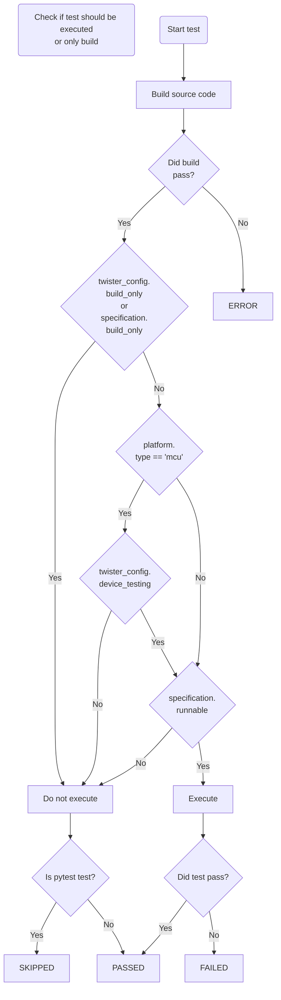

# Should be executed

In twister test can end after building or after building and executing.
Below flowchart shows how it is determined if test should be executed or not.

```mermaid
flowchart TD
    id1(Check if test should be executed\nor only build)
    S(Start test) --> BUILD
    BUILD[Build source code] --> DID_BUILD_PASS
    DID_BUILD_PASS{Did build\npass?} -- Yes --> IS_BUILD_ONLY
    DID_BUILD_PASS -- No --> ERROR
    IS_BUILD_ONLY{twister_config.\nbuild_only\nor\nspecification.\nbuild_only} -- Yes --> DO_NOT_EXECUTE
    IS_BUILD_ONLY -- No --> IS_TYPE_MCU
    IS_DEVICE_TESTING{"twister_config.\ndevice_testing"} -- No --> DO_NOT_EXECUTE
    IS_DEVICE_TESTING -- Yes --> IS_RUNNABLE
    IS_TYPE_MCU{platform.\ntype == 'mcu'} -- No --> IS_RUNNABLE
    IS_TYPE_MCU -- Yes --> IS_DEVICE_TESTING
    IS_RUNNABLE{specification.\nrunnable} -->|No| DO_NOT_EXECUTE
    IS_RUNNABLE -->|Yes| EXECUTE[Execute]
    DO_NOT_EXECUTE[Do not execute] --> IS_PYTEST
    IS_PYTEST{Is pytest test?} -- Yes --> SKIP[SKIPPED]
    IS_PYTEST -->|No| PASSED[PASSED]
    EXECUTE --> DID_TEST_PASS{Did test pass?}
    DID_TEST_PASS -- Yes --> PASSED
    DID_TEST_PASS -- No --> FAILED
```
